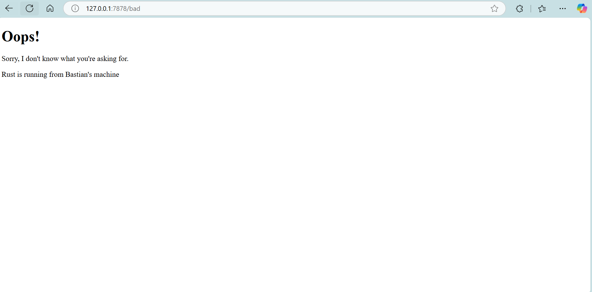

## Commit 1 reflection
Berikut implementasi fungsi handle_connection pada kode:

```
fn handle_connection(mut stream: TcpStream) {
    let buf_reader = BufReader::new(&mut stream);
    let http_request: Vec<_> = buf_reader 
        .lines() 
        .map(|result| result.unwrap()) 
        .take_while(|line| !line.is_empty()) 
        .collect();
    println!("Request: {:#?}", http_request);
}
```

Fungsi ini menerima parameter bertipe TcpStream yang merepresentasikan koneksi TCP antara server dan klien. Kata kunci mut pada parameter menunjukkan bahwa stream bersifat mutable (dapat diubah), karena operasi pembacaan data dari stream akan mengubah status internalnya.

Inti dari fungsi ini terletak pada penggunaan BufReader yang dibangun dari TcpStream. BufReader merupakan komponen Rust yang melakukan buffering untuk operasi I/O, sehingga mengurangi jumlah operasi sistem langsung saat membaca data. Ini sangat efisien untuk protokol berbasis teks seperti HTTP.

Proses pengumpulan request HTTP dilakukan melalui serangkaian method chaining:
1) ```.lines()``` – Membaca stream baris per baris, menghasilkan iterator bertipe ```Result<String>```.

2) ```.map(|result| result.unwrap())``` – Mengubah setiap ```Result``` menjadi ```String``` dengan ```unwrap()```. Ini berisiko jika terjadi error, namun cocok untuk tujuan pembelajaran.

3) ```.take_while(|line| !line.is_empty())``` – Mengambil baris hingga menemui baris kosong, sesuai spesifikasi HTTP di mana baris kosong menandai akhir header.

4) ```.collect()``` – Mengumpulkan semua baris ke dalam ```Vec<String>```.

Setelah menjalankan ```cargo run``` dan mengakses ```http://127.0.0.1:7878```, server menampilkan output berikut:
```
Request: [
    "GET / HTTP/1.1",
    "Host: 127.0.0.1:7878",
    "Connection: keep-alive",
    "sec-ch-ua: \"Chromium\";v=\"134\", \"Not:A-Brand\";v=\"24\", \"Microsoft Edge\";v=\"134\"",
    "sec-ch-ua-mobile: ?0",
    "sec-ch-ua-platform: \"Windows\"",
    "Upgrade-Insecure-Requests: 1",
    "User-Agent: Mozilla/5.0 (Windows NT 10.0; Win64; x64) AppleWebKit/537.36 (KHTML, like Gecko) Chrome/134.0.0.0 Safari/537.36 Edg/134.0.0.0",
    "Accept: text/html,application/xhtml+xml,application/xml;q=0.9,image/avif,image/webp,image/apng,*/*;q=0.8,application/signed-exchange;v=b3;q=0.7",
    "Sec-Fetch-Site: none",
    "Sec-Fetch-Mode: navigate",
    "Sec-Fetch-Dest: document",
    "Accept-Encoding: gzip, deflate, br, zstd",
    "Accept-Language: en-US,en;q=0.9,id;q=0.8",
    "Cookie: csrftoken=I76dC3qrvXIo7QQFLmTye3j9EZ06Pjup",
]
```

Output menunjukkan client mengirim permintaan HTTP GET ke path utama (/) menggunakan HTTP 1.1. Header Host: 127.0.0.1:7878 menegaskan server lokal yang diakses. User-Agent mengidentifikasi browser client sebagai Microsoft Edge 134 di Windows. Header keamanan seperti sec-ch-ua dan sec-ch-ua-platform memberi detail browser dan OS, sementara Cookie mengandung token CSRF untuk keamanan. Header Accept-Encoding dan Accept-Language menunjukkan preferensi kompresi data dan bahasa yang diinginkan client.

Seluruh data ini dibaca oleh BufReader dari koneksi TCP, berhenti saat menemui baris kosong sesuai standar HTTP. Meski sederhana, kode ini menjadi dasar untuk mempelajari cara server web membaca permintaan HTTP di Rust.

## Commit 2 reflection


Berikut perubahan code pada milestone 2:
```
 use std::{
     fs,
     ...
 }
 
 fn handle_connection(mut stream: TcpStream) {
     let buf_reader = BufReader::new(&mut stream);
     let http_request: Vec<_> = buf_reader
         .lines() 
         .map(|result| result.unwrap()) 
         .take_while(|line| !line.is_empty())
         .collect();
 
     let status_line = "HTTP/1.1 200 OK"; 
     let contents = fs::read_to_string("hello.html").unwrap(); 
     let length = contents.len();
 
     let response = format!("{status_line}\r\nContent-Length: {length}\r\n\r\n{contents}");
     stream.write_all(response.as_bytes()).unwrap();
 }
 ```

 Pada kode yang diperbarui, fungsi ```handle_connection``` tidak hanya membaca permintaan HTTP dari klien tetapi juga membangun respons untuk dikirim kembali. Server menggunakan ```BufReader``` untuk membaca stream koneksi TCP baris per baris hingga menemui baris kosong, yang menandai akhir header HTTP. Meskipun permintaan dikumpulkan ke variabel ```http_request```, data ini belum diproses lebih lanjut—menunjukkan bahwa server saat ini merespons semua permintaan dengan cara yang sama, terlepas dari isi request-nya.

Setelah membaca permintaan, server menyiapkan respons HTTP dengan status ```200 OK```, lalu membaca isi file ```hello.html``` menggunakan ```fs::read_to_string```. Header ```Content-Length``` dihitung berdasarkan panjang konten HTML untuk memastikan klien dapat memahami batas data yang diterima. Seluruh respons dikemas dalam format string yang sesuai standar HTTP (status line, header, baris kosong, dan body), lalu dikirim ke klien melalui ```stream.write_all()```. Dengan ini, server mampu mengirim halaman HTML statis ke browser klien sebagai tanggapan atas permintaan apa pun.

Setelah menjalankan ```cargo run``` dan mengakses ```http://127.0.0.1:7878```, server menampilkan output berikut:

```
PS C:\Users\Basti\OneDrive\Desktop\Folders\Kuliah\Semester 4\ADPRO\hello> cargo run
warning: unused variable: `http_request`
  --> src\main.rs:16:9
   |
16 |     let http_request: Vec<_> = buf_reader
   |         ^^^^^^^^^^^^ help: if this is intentional, prefix it with an underscore: `_http_request`
   |
   = note: `#[warn(unused_variables)]` on by default

warning: `hello` (bin "hello") generated 1 warning
    Finished `dev` profile [unoptimized + debuginfo] target(s) in 0.03s
     Running `target\debug\hello.exe`
```

## Commit 3 reflection



berikut code modified handle_connection:

```
fn handle_connection(mut stream: TcpStream) {
    let buf_reader = BufReader::new(&mut stream);
    let http_request: Vec<_> = buf_reader
        .lines()
        .map(|result| result.unwrap())
        .take_while(|line| !line.is_empty())
        .collect();

    let request_line = &http_request[0]; // e.g., "GET / HTTP/1.1"

    let (status_line, filename) = if request_line.contains("/bad") {
        ("HTTP/1.1 404 NOT FOUND", "404.html")
    } else {
        ("HTTP/1.1 200 OK", "hello.html")
    };

    let contents = fs::read_to_string(filename).unwrap();
    let length = contents.len();

    let response = format!("{status_line}\r\nContent-Length: {length}\r\n\r\n{contents}");

    stream.write_all(response.as_bytes()).unwrap();
}
```
Dalam penanganan permintaan HTTP, kita perlu memutuskan respon apa yang diberikan bergantung pada permintaan dari client. Biasanya kita mengecek request_line dari client yang bentuknya seperti:
```
GET / HTTP/1.1
GET /bad HTTP/1.1
```

Berdasarkan path (```/``` atau ```/bad```), kita bisa menentukan:

- Status line -> apakah itu ```200 OK``` atau ```404 NOT FOUND```
- Nama file HTML mana yang akan diberikan sebagai isi response ->```hello.html``` atau ```404.html```
Bagian ini ditangani dalam fungsi ```get_response()```, yang memisahkan decision logic dari sisa kode.


Berikut code setelah refactoring:
```
fn handle_connection(mut stream: TcpStream) {
    let buf_reader = BufReader::new(&mut stream);
    let http_request: Vec<_> = buf_reader
        .lines()
        .map(|result| result.unwrap())
        .take_while(|line| !line.is_empty())
        .collect();

    let request_line = &http_request[0]; // GET /path HTTP/1.1
    let (status_line, filename) = get_response(request_line);

    let response = build_response(status_line, filename);

    stream.write_all(response.as_bytes()).unwrap();
}

fn get_response(request_line: &str) -> (&str, &str) {
    if request_line.contains("/bad") {
        ("HTTP/1.1 404 NOT FOUND", "404.html")
    } else {
        ("HTTP/1.1 200 OK", "hello.html")
    }
}

fn build_response(status_line: &str, filename: &str) -> String {
    let contents = fs::read_to_string(filename).unwrap();
    let length = contents.len();

    format!("{status_line}\r\nContent-Length: {length}\r\n\r\n{contents}")
}
```

Awalnya, seluruh kode untuk menangani permintaan HTTP bercampur di dalam satu fungsi ```handle_connection()```. Di dalam fungsi ini, terdapat logika untuk menentukan status respon, membaca file HTML, serta membangun dan mengirimkan respon HTTP ke client. Pendekatan seperti ini membuat kode menjadi sulit dibaca karena berbagai tanggung jawab bercampur aduk dalam satu fungsi. Selain itu, struktur seperti ini juga menyulitkan proses pengembangan di masa depan. Misalnya, ketika ingin menambahkan lebih banyak route seperti```/about``` atau ```/contact```, atau ketika ingin mendukung metode HTTP lain seperti POST, kode yang tidak terstruktur ini akan sulit untuk di-maintain dan diperluas. Reusabilitas kode juga rendah karena tidak ada pemisahan logika yang memungkinkan penggunaan kembali bagian-bagian tertentu dari kode di tempat lain.

Setelah dilakukan refactoring dengan memisahkan kode ke dalam fungsi ```get_response()``` dan ```build_response()```, kode menjadi lebih modular. Setiap fungsi sekarang memiliki satu tugas yang jelas, sehingga kode lebih mudah dibaca dan dipahami. Selain itu, refactoring ini membuat kode lebih mudah untuk diubah dan diperluas. Misalnya, untuk menambahkan route baru, kita hanya perlu melakukan perubahan pada fungsi ```get_response()``` tanpa harus mengganggu bagian kode lainnya. Struktur kode yang baru ini juga lebih terorganisir dan mengikuti prinsip Single Responsibility Principle (SRP), di mana setiap fungsi atau modul hanya memiliki satu alasan untuk berubah. Hal ini membuat kode lebih bersih, lebih mudah dirawat, dan siap untuk dikembangkan lebih lanjut.


## Commit 4 reflection

Berikut perubahan code:

```
use std::{
    fs,
    io::{prelude::*, BufReader},
    net::{TcpListener, TcpStream},
    thread,
    time::Duration,
};
// --snip--

fn handle_connection(mut stream: TcpStream) {
    // --snip--

    let (status_line, filename) = match &request_line[..] {
        "GET / HTTP/1.1" => ("HTTP/1.1 200 OK", "hello.html"),
        "GET /sleep HTTP/1.1" => {
            thread::sleep(Duration::from_secs(10));
            ("HTTP/1.1 200 OK", "hello.html")
        }
        _ => ("HTTP/1.1 404 NOT FOUND", "404.html"),
    };

    // --snip--
}
```

Ketika kita membuka dua windows browser dan mengakses ```127.0.0.1/sleep``` di salah satunya, kita akan melihat bahwa halaman membutuhkan waktu lama untuk dimuat. Hal ini terjadi karena pada route ```/sleep```, server secara sengaja menunda respon selama 10 detik menggunakan ```thread::sleep(Duration::from_secs(10))```. Selama proses penundaan ini, thread yang menangani koneksi tersebut akan berhenti sementara (blocking), sehingga tidak dapat melayani permintaan lainnya.

Jika di windows browser lain kita mengakses ```127.0.0.1/```, maka halaman tersebut juga akan ikut lambat atau tertunda, karena server hanya menjalankan satu thread utama untuk menangani semua koneksi secara bergiliran (single-threaded). Ini berarti selama satu permintaan masih diproses, permintaan lainnya harus menunggu hingga selesai. Jika ada banyak pengguna yang mencoba mengakses server secara bersamaan, maka semua permintaan akan mengantri dan performa server akan sangat lambat.

## Commit 5 reflection
Berikut code pada lib.rs
```
pub struct ThreadPool;

impl ThreadPool {
    pub fn new(size: usize) -> ThreadPool {
        assert!(size > 0);
        ThreadPool
    }

    pub fn execute<F>(&self, f: F)
    where
        F: FnOnce() + Send + 'static,
    {
        std::thread::spawn(f);
    }
}
```

Berikut code perubahan pada main.rs
```
use hello::ThreadPool;

fn main(){
    ...
    let pool = ThreadPool::new(4);

    for stream in listener.incoming() {
        ...

        pool.execute(|| {
            handle_connection(stream);
        });
    }
}
```

Perubahan utama yang dilakukan adalah menambahkan kemampuan multithreading pada server sederhana tersebut dengan menggunakan ```ThreadPool```. Pada kode sebelumnya, server hanya dapat memproses satu koneksi pada satu waktu karena setiap permintaan ditangani secara langsung dalam loop ```for stream in listener.incoming()``` tanpa threading. Akibatnya, ketika ada permintaan ke endpoint ```/sleep```, server akan melakukan ```sleep``` selama 10 detik, yang menyebabkan permintaan lain harus menunggu hingga permintaan tersebut selesai. Hal ini membuat server menjadi lambat dan tidak responsif saat menangani banyak pengguna secara bersamaan.

Untuk meningkatkan performa, dibuat sebuah ```ThreadPool``` pada file ```lib.rs``` yang memungkinkan server memproses beberapa koneksi secara paralel. Struktur ```ThreadPool``` ini sederhana; ketika metode ```execute``` dipanggil, sebuah thread baru langsung dibuat menggunakan ```std::thread::spawn``` untuk menjalankan closure yang diberikan. Di ```main.rs```, server kemudian menggunakan thread pool ini untuk menjalankan ```handle_connection``` secara paralel pada setiap koneksi yang masuk. Hal ini membuat server dapat menangani banyak permintaan sekaligus, tanpa saling menunggu satu sama lain, sehingga lebih efisien dan responsif.

Secara keseluruhan, perubahan ini mendemonstrasikan konsep dasar concurrency pada server HTTP, di mana setiap koneksi klien ditangani oleh thread yang berbeda, mengurangi waktu tunggu klien lain meskipun ada permintaan yang memerlukan waktu proses lebih lama, seperti ```/sleep```.

## Commit bonus reflection

perubahan pada code:

lib.rs
```
pub struct ThreadPool{
    size: usize,
}

impl ThreadPool {
    pub fn build(size: usize) -> ThreadPool {
        assert!(size > 0);
        println!("Membangun ThreadPool dengan {} thread!", size);
        ThreadPool { size }
    }

    pub fn execute<F>(&self, f: F)
    where
        F: FnOnce() + Send + 'static,
    {
        println!("Menjalankan task di thread pool dengan {} thread", self.size); // log tambahan
        std::thread::spawn(f);
    }
}
```

main.rs
```
fn main() {
    ...
    let pool = ThreadPool::build(4);
    ...
}
```

Perbedaan utama antara ```build``` dan ```new``` dalam kode di atas terletak pada penamaan fungsi dan tujuannya dalam membangun sebuah instance ```ThreadPool```. Secara konvensi, fungsi ```new``` di Rust biasanya digunakan untuk membuat instance baru dari sebuah struct dengan cara yang sederhana dan langsung. Namun, dalam kode yang telah diperbarui, kita menggunakan fungsi ```build``` sebagai pengganti ```new``` untuk memberikan makna yang lebih spesifik, yaitu bahwa proses pembuatan ```ThreadPool``` ini mungkin melibatkan langkah-langkah persiapan atau konfigurasi tambahan di masa mendatang. Pada kode saat ini, ```build``` digunakan untuk menginisialisasi ```ThreadPool``` sekaligus mencetak informasi tentang jumlah thread yang digunakan, memberikan gambaran bahwa kita sedang "membangun" sebuah pool worker, bukan sekadar membuat instance biasa. Penggunaan ```build``` juga memberi fleksibilitas dalam pengembangan selanjutnya jika ingin menambahkan proses setup yang lebih kompleks, seperti membuat thread worker atau menyiapkan queue task. Dengan demikian, penggunaan ```build``` dalam kode ini memberi konteks yang lebih deskriptif dan membuka kemungkinan ekspansi fitur tanpa mengubah kontrak atau perilaku metode ```new``` yang lebih umum.